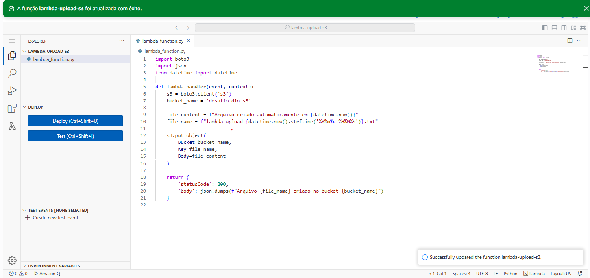
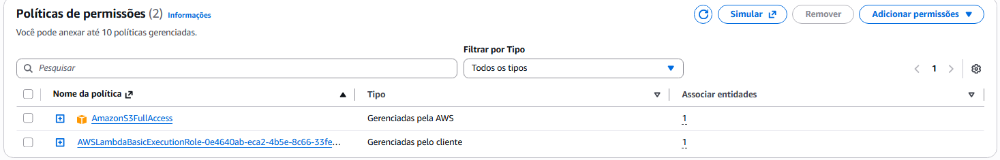
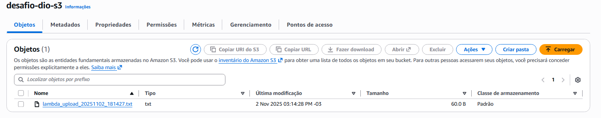

# Projeto DIO - Tarefas Automatizadas com Lambda e S3

## Objetivo
Demonstrar o uso da AWS Lambda para automatizar o envio de arquivos para um bucket Amazon S3

## Estrutura do repositório

```
📂 aws-cloudformation-lab
┣ 📂 images
┣ 📄 README.md
┗ 📄 lambdafunction.py
```

## Tecnologias
- AWS Lambda
- Amazon S3
- Python 3.x
- IAM (permissões)

## Funcionamento
1. A função Lambda é executada manualmente ou por evento.
2. Ela cria e envia um arquivo `.txt` para o bucket S3 (`desafio-dio-s3`).
3. O conteúdo do arquivo inclui a data e hora da criação.

## Imagens



 

